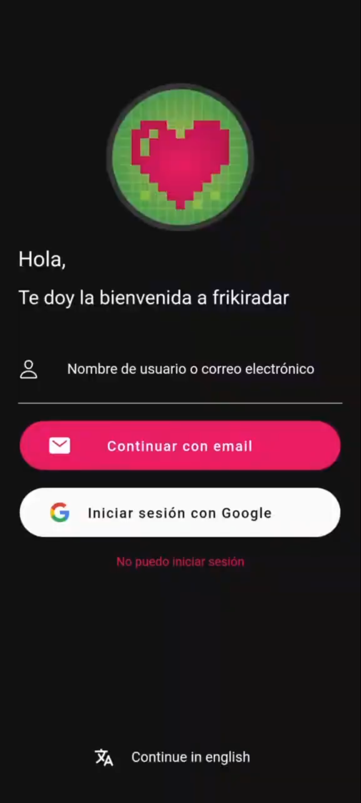
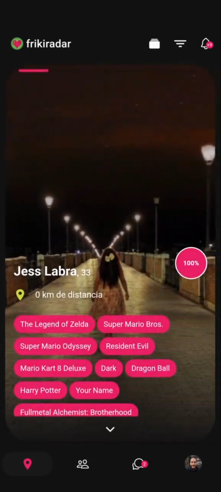
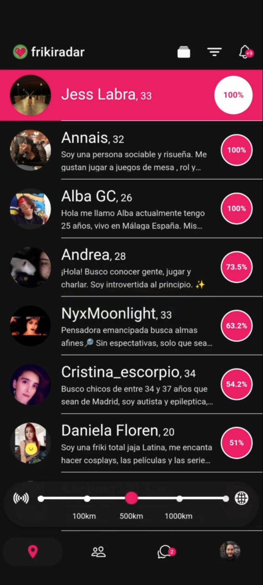
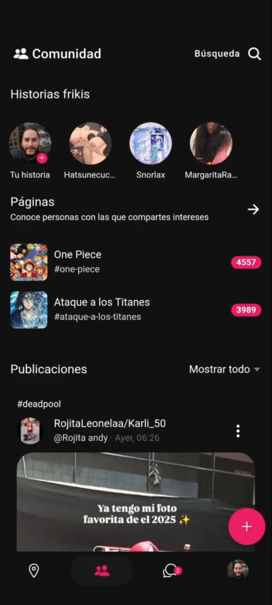

# Frikiradar Backend

> Proyecto histórico, actualmente sin soporte activo. Este repositorio se conserva solo como referencia y consulta.

## ¿Qué es Frikiradar?
Frikiradar es una plataforma social para fans de la cultura friki, videojuegos, manga, anime y más. Permite conectar personas con intereses afines, organizar eventos, enviar notificaciones y gestionar perfiles, todo con un enfoque en la comunidad y la seguridad.

### Principales funcionalidades
- Gestión de usuarios y perfiles
- Sistema de eventos y citas
- Chat y notificaciones
- Panel de administración
- Mailing y recuperación de cuenta
- Integración con pagos y suscripciones
- Moderación y seguridad (detección de dispositivos, avisos, bloqueo de usuarios)
- Gestión de páginas, etiquetas y categorías

### Tecnologías utilizadas
- PHP (Symfony)
- MySQL
- Twig (plantillas)
- Stripe, PayPal, PHPMailer
- Docker, Composer
- JWT para autenticación
- Integración con APIs externas (traducción, imágenes, etc.)

### Historia
Frikiradar estuvo activo como plataforma social y app móvil entre diciembre de 2017 y marzo de 2025, con miles de usuarios registrados y eventos organizados. El backend aquí presente gestionaba toda la lógica de negocio y comunicación con la app y el panel web.

## Logotipo y capturas de pantalla
La web corporativa estuvo en [frikiradar.com](https://frikiradar.com) y la aplicación PWA en [frikiradar.app](https://frikiradar.app) (ya no disponible). También se lanzó en Android y iOS.

### Logotipo

### Capturas de pantalla
Puedes añadir aquí hasta 4 capturas representativas del proyecto en la carpeta `public/images/layout/`:

	
	
	
	

> El proyecto integraba tecnología PWA y notificaciones push, permitiendo instalación en dispositivos y experiencia mejorada en móviles.

## Contacto
- Alberto Oishii (albertooishii@gmail.com)

---

> Este proyecto es solo para consulta y aprendizaje. No se permite su uso comercial ni productivo.
